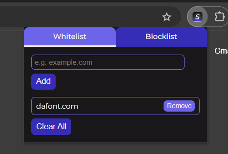

# 🚀 Synapse Chrome Extension

A Chrome extension to help users stay productive by blocking distracting websites during focus sessions.

---

## ✨ Features

- ✅ **Focus Mode controlled via Firebase Realtime Database**
- ✅ **Whitelist domains** — allow certain sites during focus mode
- ✅ **Blocklist domains** — block specific sites during focus mode
- ✅ **Overlay popup when a blocked site is opened** — user must provide a reason
- ✅ **Distraction logs saved locally** (with timestamp)
- ✅ **Dynamic User ID Generation** — generates a únicos 16-character user ID stored locally for personalized Firebase interactions
- ✅ **Modern UI with tabs for Whitelist and Blocklist**

---

## 🛠 Installation & Setup

### 1️⃣ Clone the repository

```bash
git clone https://github.com/your-username/focus-mode-extension.git
cd focus-mode-extension
```

### 2️⃣ Set up Firebase

- Go to [Firebase Console](https://console.firebase.google.com/)
- Create a project (if you don’t have one)
- Enable Realtime Database
- Copy your web app config
- 👉 In `env.js`, rename `env.example.js` and replace the config object with your Firebase credentials:

```javascript
export const FIREBASE_CONFIG = {
  apiKey: "YOUR_API_KEY",
  authDomain: "YOUR_AUTH_DOMAIN",
  databaseURL: "YOUR_DB_URL",
  projectId: "YOUR_PROJECT_ID",
  storageBucket: "YOUR_STORAGE_BUCKET",
  messagingSenderId: "YOUR_SENDER_ID",
  appId: "YOUR_APP_ID",
  measurementId: "YOUR_MEASUREMENT_ID"
};
```

### 3️⃣ Load the extension into Chrome

1. Open Chrome → `chrome://extensions/`
2. Enable **Developer Mode** (toggle at the top right)
3. Click **Load unpacked**
4. Select the directory where you cloned this project

### 4️⃣ Set up your Firebase paths

✅ The extension auto-creates:

```bash
/users/{USER_ID}/settings/focusMode
/users/{USER_ID}/distractions
```

where `{USER_ID}` is a dynamically generated 16-character hash stored in `chrome.storage.local`.

### 5️⃣ Add domains to whitelist/blocklist

- Click the extension icon → manage Whitelist & Blocklist
- Add/remove domains as needed

### 6️⃣ Test

- Enable focus mode by setting `/users/{USER_ID}/settings/focusMode = true` in Firebase
- Try opening a blocked site
- Overlay popup appears → enter reason → tab closes → reason logged
- Right-click extension icon → Show Logs → view logs

### ⚡ Example Screenshot



## 💡 Future Enhancements

- Charts / reports of distractions
- Auto-schedule focus mode
- Cloud sync for lists
- Password protected overrides

## 📝 License

MIT License

## 👑 Author

Made with ❤️ by Starcode Crusaders
